## 一、P2P金融行业业务安全检测项即监管要求：
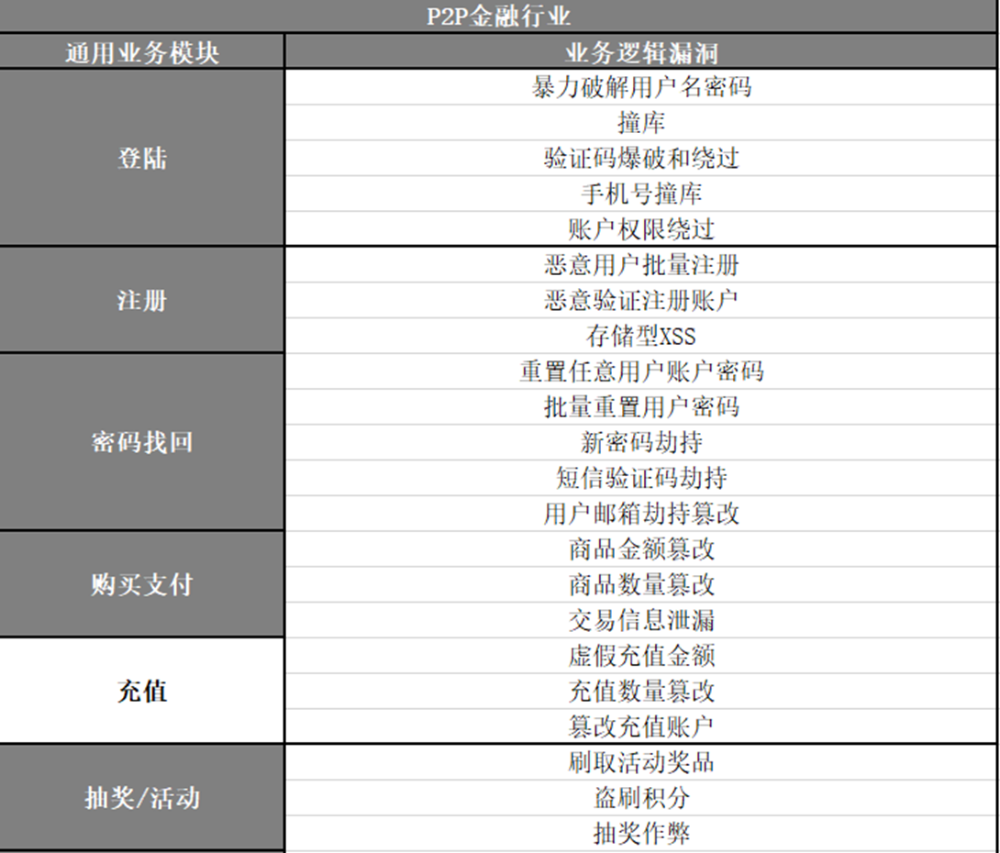
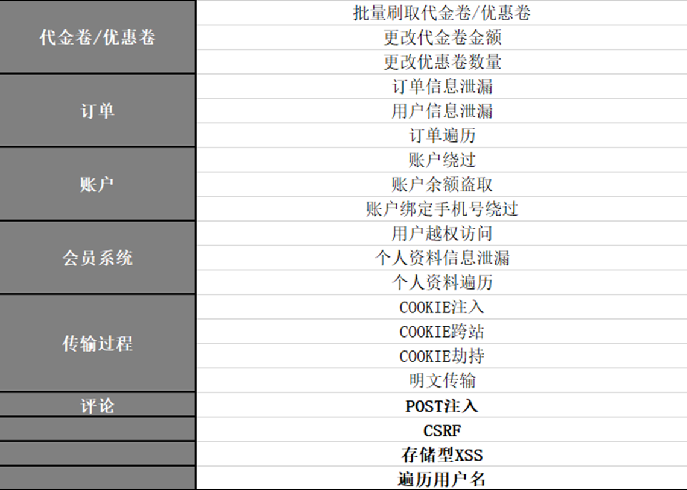
## 二、OWASP TOP 10：
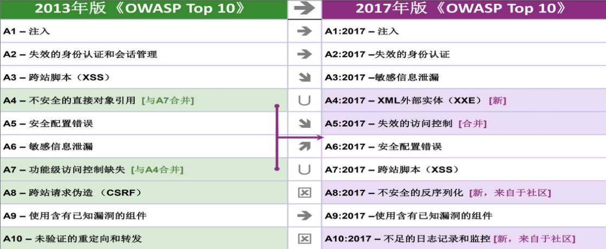
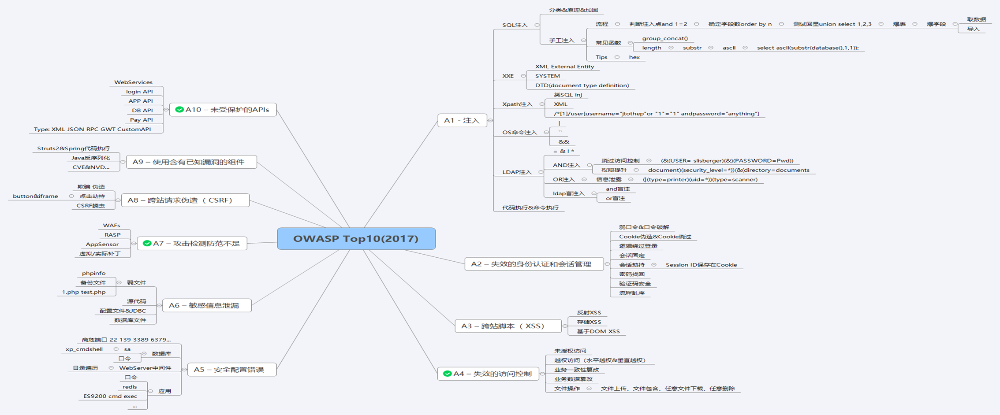
##三、SQL注入漏洞的原理和利用

SQL注入：所谓SQL注入，就是通过把SQL命令插入到Web表单提交或输入域名或页面请求的查询字符串，最终达到欺骗服务器执行恶意的SQL命令。攻击者利用有针对性的解释器语法发送简单的、基于文本的攻击。几乎任何数据源都能成为注入载体，包括内部来源。注入漏洞的本质是原本代码拼接了用户可控数据,导致原本代码语义混淆而导致的安全缺陷。

SQL安全现状：没有统一的安全编码规范。

风险：上得了机器权限，下得了数据，数据库被脱裤，管理员和重要人员信息泄露，获得Webshell，系统sa权限以及root权限。

注入类型：

1.常见的注入类型有：布尔盲注,时间盲注,报错注入,联合查询注入,堆叠查询注入。

2.按照攻击入口分：GET型的SQL注入、POST型的注入、Cookie型的注入等。

3.按照注入点类型分：整型注入、字符型注入等。

SQL注入漏洞的产生（以Mysql+PHP为例）：

1、使用动态拼接的SQL语句

2、页面异常信息（错误信息）处理不当

3、未判断变量传入合法性
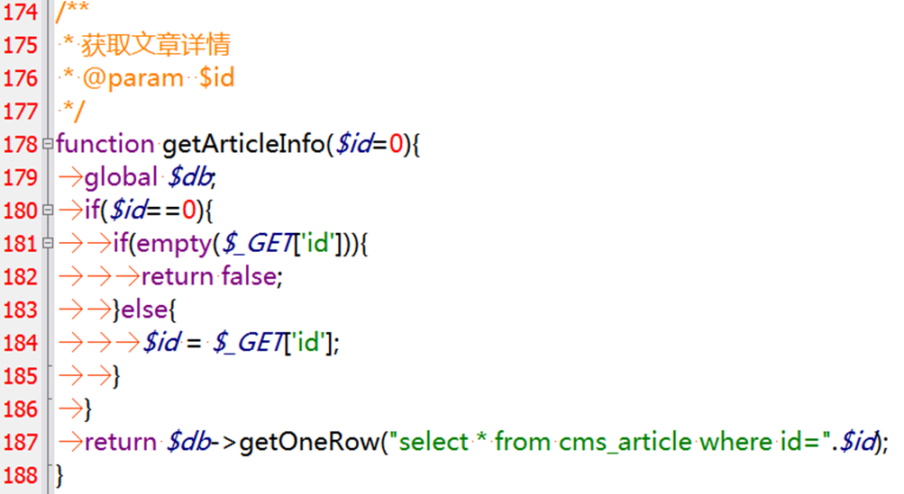
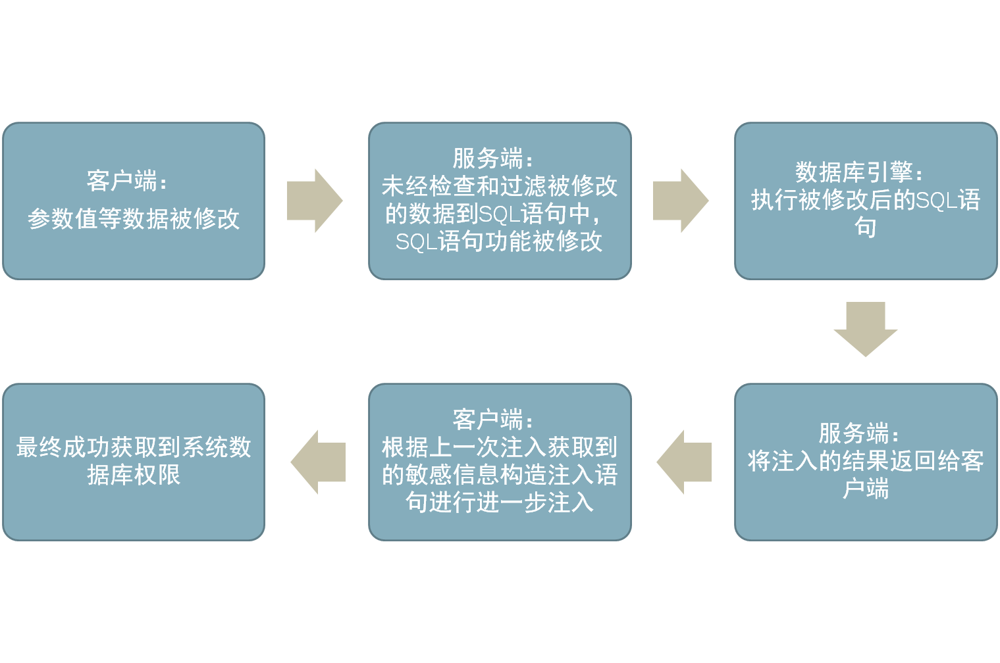
哪里能找到注入漏洞？

•表单提交，主要是POST请求，也包括GET请求。

•URL参数提交，主要为GET请求参数。

•Cookie参数提交。

•HTTP请求头部可修改的值，比如: Referer、User_Agent等。

•边缘的输入点，比如.mp3文件的一些文件信息等。
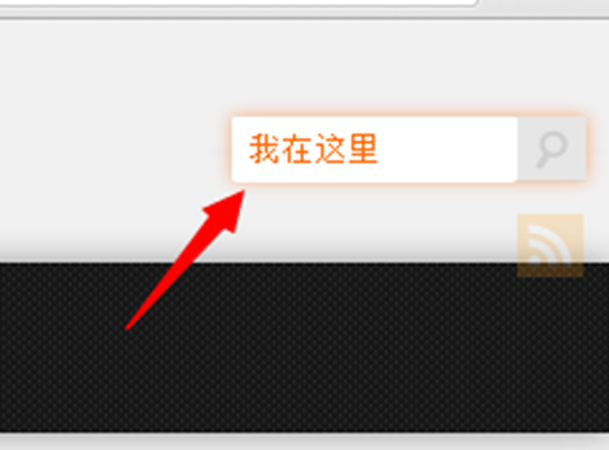
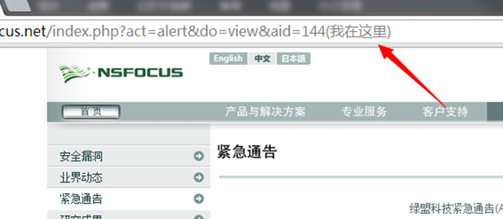
SQL注入漏洞的利用： 

使用工具

优点: 自动化、范围广、效率高

缺点: 误报、漏报、测试方法有限

手工测试 

优点: 测试方法灵活

缺点: 效率低、范围窄、因测试者技术水平而异

 
## 四、失效的身份验证和会话管理

攻击者可以利用认证或会话管理功能中的泄露或漏洞（比如暴露的账户、密码、或会话ID）来假冒用户。开发者通常会建立自定义的认证和会话管理方案。但要正确实现这些方案却很难，结果这些自定义的方案往往在以下方面存在漏洞：

1.退出机制

2.密码管理

3.超时

4.记住我

5.安全问题

6.账户恢复

例1：应用程序超时设置不当。用户使用公共计算机访问网站。离开时，该用户没有点击退出，而是直接关闭浏览器。攻击者在一个小时后能使用相同浏览器通过身份认证。

例2：机票预订应用程序支持URL重写，把会话ID放在URL里：;jsessionid=2P0OC2JDPXM0OQSNDLPSKHCJUN2JV?dest=Hawaii

该网站一个经过认证的用户希望让他朋友知道这个机票打折信息。他将上面链接通过邮件发给他朋友们，并不知道自己已经泄漏了自己的会话ID。当他的朋友们使用上面的链接时，他们将会使用他的会话和信用卡。
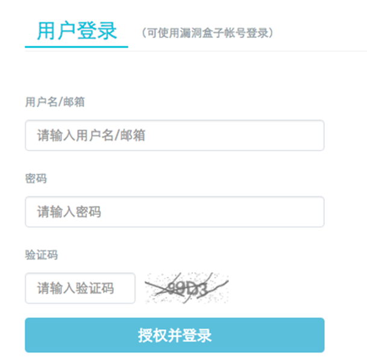
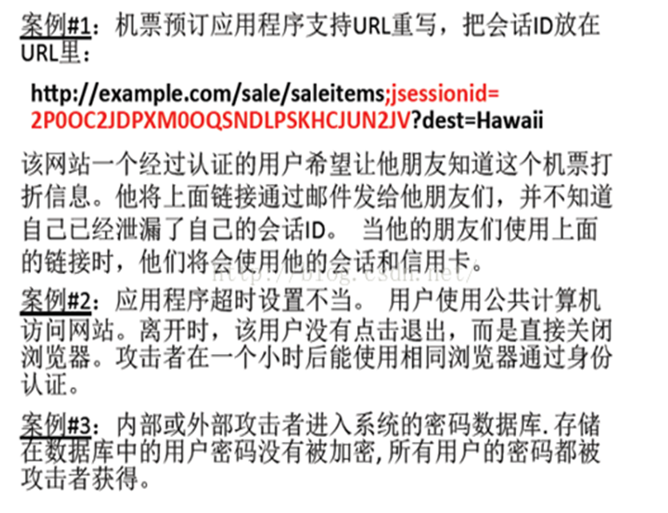
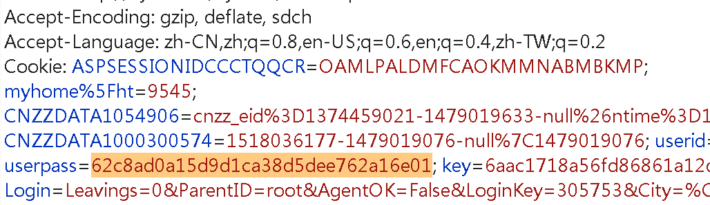
## 五、任意文件上传漏洞

 什么是任意文件上传漏洞？

允许用户上传任意文件，可能会让攻击者注入危险内容或恶意代码，并在服务器上运行。

任意文件上传漏洞原理

由于文件上传功能实现代码没有严格限制用户上传的文件后缀以及文件类型，导致允许攻击者向某个可通过Web访问的目录上传任意PHP文件，并能够将这些文件传递给PHP解释器，就可以在远程服务器上执行任意PHP脚本。

任意文件上传漏洞的危害

上传漏洞是一个非常恐怖的漏洞，如果你的程序里面有这种漏洞，那么恶意攻击者可以直接向你的服务器上传一个 webshell( 又称 ASP 木马、PHP 木马等即利用服务器端的文件操作语句写成的动态网页，可以用来编辑你服务器上的文件 )，从而控制你的网站。

任意文件上传漏洞解决方案

检查是否判断了上传文件类型及后缀；定义上传文件类型白名单，即只允许上传的文件类型 ；文件上传目录禁止脚本解析。

 

## 六、XSS漏洞的原理和利用

Xss(跨站脚本攻击)

什么是XSS，简单点说就是黑客往Web页面里插入恶意Script代码，当用户浏览该网页时，嵌入其中Web里面的Script代码会被执行，从而达到恶意攻击用户的目的。

XSS的分类

XSS根据其特性和利用手法的不同，主要分为两大类型：一种是反射型跨站脚本,另一种是存储型跨站脚本。

XSS跨站脚本实例

来看一段代码
> ```
><html>
><head>test</head>
><body>
><script>alert("xss")</script>
></body>
></html>
> ```
这是一段很简单的HTML代码，其中包括一个Javascript语句块，该语句块使用内置的alert()函数来打开一个消息框,消息框中显示XSS信息。
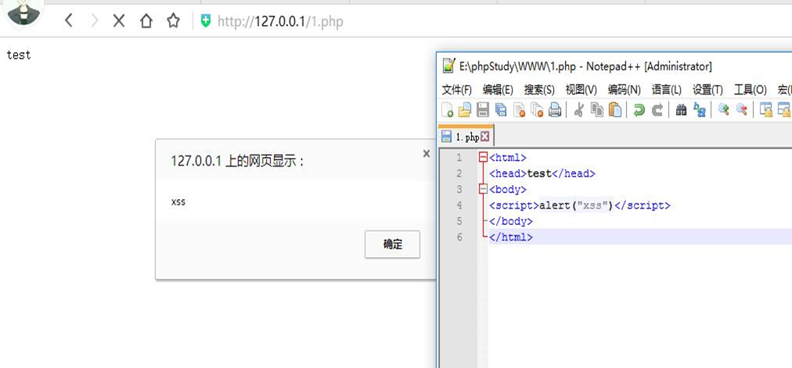
XSS攻击就是将非法的Javascript、Vbscript等脚本注入到用户浏览的网页上执行，而Web浏览器本身的设计是不安全的，它只是负责解释和执行Javascript等脚本语言,而不会判断代码本身是否对用户有害。
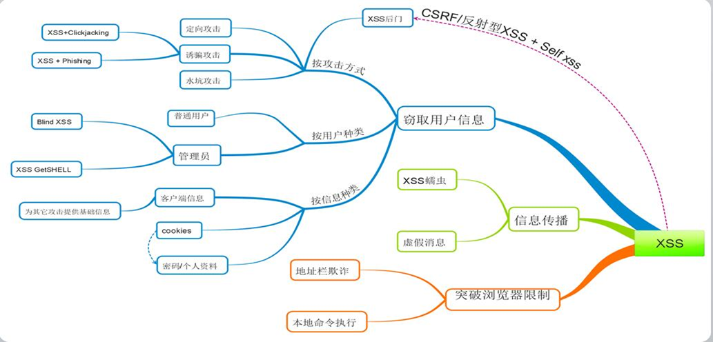
## 七、跨站请求伪造(CSRF)

CSRF是一种Web应用攻击方式，该攻击可以在受害者毫不知情的情况下以受害者名义伪造请求发送给受攻击站点，从而在并未授权的情况下执行在权限保护之下的操作。

跨站请求伪造(CSRF) VS 跨站脚本攻击(XSS)

1.XSS直接作用在客户端浏览器；CSRF直接作用在服务端；

2.XSS可执行用户任何操作（获取到用户cookie后）；CSRF只能执行特定操作；

3.CSRF需在用户登陆情况下完成攻击；XSS可以在客户端做任何Js脚本可以做的事情，即使用户不在登陆状态。
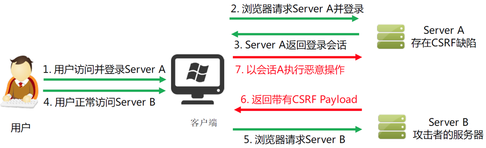
## 八、个人对公司安全发展的心愿

1.技术防护能力跟上时代；

2.形成成熟的安全管理体系；

3.保持安全合规，保持符合国家层面或行业层面安全要求的良好状态；

4.做好以上3点，使得风险看得见、事件管得住、管理落了地。
