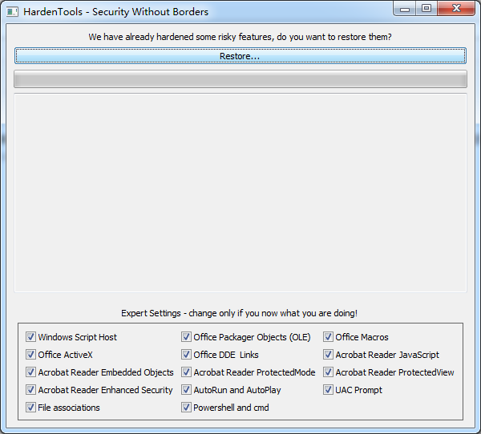
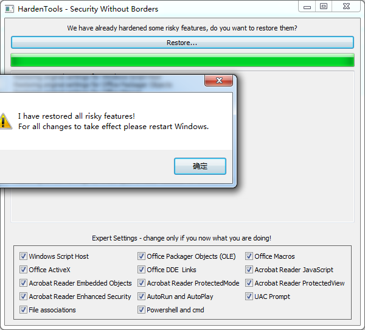

Hardentools是一组简单的实用程序，旨在禁用操作系统（Microsoft Windows，现在）以及主要的消费者应用程序公开的许多“功能”。这些通常为企业客户所设想的功能，对于普通用户来说通常是无用的，而且由于攻击者非常普遍地滥用其在受害者的计算机上执行恶意代码而构成危险。这个工具的目的是通过禁用低悬的果实来减少攻击面。Hardentools适用于有风险的个人，他们可能希望以某种可用性为代价获得额外的安全级别。它不适用于企业环境。

