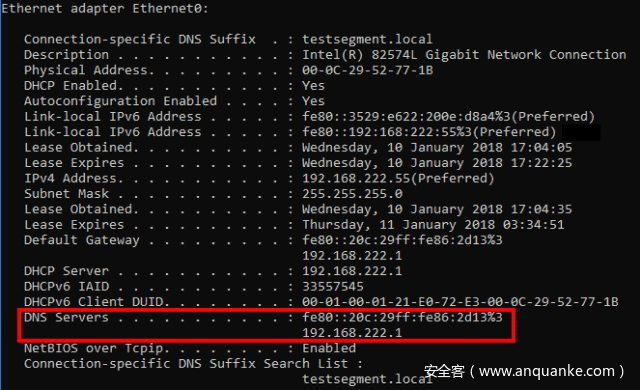
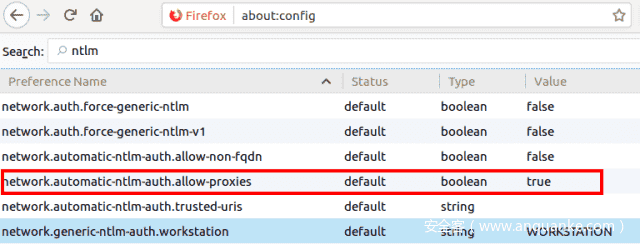

## 一、前言
虽然IPv6正在互联网上逐步推广，但在内部网络环境中使用IPv6的公司依然非常稀少。然而，大多数公司并不知道，即使他们没有主动去使用IPv6，但从Windows Vista以来，所有的Windows系统（包括服务器版系统）都会启用IPv6网络，并且其优先级要高于IPv4网络。在本文中，我们介绍了一种攻击方法，这种攻击可以滥用Windows网络中默认的IPv6配置，充当恶意DNS服务器来伪造DNS应答报文，将网络流量重定向至攻击者指定的端点。在攻击的第二阶段，攻击者会利用（恶名远扬的）WPAD（Windows Proxy Auto Discovery，Windows代理自动发现）功能，将凭证及身份认证信息传递给网内的各种服务。Fox-IT公布了名为mitm6的一个工具，可以实施这种攻击，具体代码可以从Fox-IT的GitHub页面上下载。
## 二、IPv6攻击
IPv6的推广速度并不快，与此同时，关于如何滥用IPv6的技术资源远比IPv4渗透技术资源要少得多。虽然每本书或者每个课程中都会提到类似ARP欺骗之类的技术，但这些参考资料很少会提及IPv6，并且能够用来测试或者滥用IPv6配置的工具也不多。THC IPv6攻击套装是为数不多的几款可用工具之一，这套工具也是mitm6的灵感来源。本文中介绍的攻击方法是SLAAC攻击思路的子集，SLAAC是Alex Waters于2011年在Infosec网站上提出的一种攻击思路。SLAAC的主要思想是创建一个恶意IPv6路由器，通过各种服务实现对目标网络内所有流量的中间人（man-in-the-middle）攻击。随后不久，Neohapsis公布了名为suddensix的一款工具，可以自动实施这种攻击。

SLAAC攻击方法存在不足之处，这种攻击需要在已有的IPv4网络的基础上，为当前的所有设备创建一个IPv6覆盖（overlay）网络。对渗透测试而言这显然不是理想的攻击场景，因为这会迅速破坏网络的稳定性。此外，这种攻击需要依赖许多外部软件包及服务才能正常工作。为了解决这种缺点，mitm6应运而生。mitm6安装起来非常方便，可以有选择性地攻击特定主机、伪造DNS响应数据，同时也能最大限度地减少对目标网络正常运行的干扰。你所需要的只是一个python脚本，运行之前基本不需要进行配置，在几秒钟内就能发起攻击。我们在该工具中设置了超时时间，因此当攻击结束时，整个网络会在几分钟内恢复到之前的状态。
## 三、mitm6攻击
### 阶段1：控制主DNS服务器
首先，mitm6会在攻击者主机的主接口上监听，观察通过DHCPv6协议获取IPv6配置的Windows主机。从Windows Vista开始，默认情况下每台Windows主机都会定期请求这种配置信息。通过Wireshark抓取的相关数据包如下所示：

mitm6会应答这些DHCPv6请求，为这些受害主机分配本地链路范围内的IPv6地址。在实际的IPv6网络中，这些地址由主机自身自动分配，完全不需要通过DHCP服务器来配置。通过这种方法，我们有机会将攻击者的IP设置为默认的IPv6 DNS服务器，为受害主机提供DNS服务。需要注意的是，目前mitm6只能针对基于Windows的操作系统，其他操作系统（如macOS以及Linux）并没有使用DHCPv6协议来配置DNS服务器。

mitm6并不会对外宣称自己为网关节点，因此目标网络内的主机并不会尝试与本���网段或VLAN之外的IPv6主机通信。这样可以限制攻击行为对整体网络的影响，因为mitm6不会尝试以中间人身份攻击网内的所有流量，而是会选择性地欺骗某些主机（攻击者可以在mitm6运行过程中指定需要过滤的域）。

mitm6的攻击过程如下图所示。该工具可以自动探测攻击者主机的IP配置情况，应答本网络内客户端发送的DHCPv6请求报文，应答报文中会指定攻击者的IP为DNS服务器所在地址。此外，mitm6可以周期性地发送RA（Router Advertisment，路由器宣告）报文，提醒客户端当前环境中存在一个IPv6网络，需要通过DHCPv6协议来获取IPv6地址，这是mitm6的一个可选功能。某些情况下，这么做可以加快攻击速度，但这并不是必选项，如果目标网络中部署了诸如RA Guard之类的防御机制来防护SLAAC攻击，那么可以考虑启用该功能。

### 阶段2：DNS欺骗
在受害主机上，可以看到我们的服务器已经被配置为DNS服务器。由于Windows在处理IP协议时有先后顺序，IPv6的DNS服务器优先级会比IPv4的DNS服务器更高，因此Windows主机会向IPv6 DNS服务器查询A（IPv4）及AAAA（IPv6）记录。

接下来，我们的目标是让客户端连接到攻击者的主机，而不是合法服务器。我们的最终目标是让用户或者浏览器自动向攻击者主机发起身份认证请求，这也是我们在testsegment.local这个内部网络中进行URL欺骗的原因所在。在步骤1的截图中，你可以观察到客户端在分配了IPv6地址后，会第一时间请求wpad.testsegment.local的相关信息。我们会在本次攻击过程中利用到这一现象。
## 四、利用WPAD
### 在MS16-077之前滥用WPAD
Windows代理自动检测功能一直以来都是充满争议的一个话题，渗透测试人员多年来一直在滥用这个功能。正常情况下，企业网络环境中可以利用这一功能来自动探测网络代理，通过该代理访问互联网。保存相关信息的wpad.dat文件由某个服务器来提供，在早些时候，该服务器的地址需要使用DNS来解析，如果DNS无法解析这一地址，那么系统会通过不安全的广播协议（如链路本地多播名称解析（LLMNR）协议）来解析服务器地址。攻击者可以应答这些广播名称解析协议，对外宣称WPAD文件位于攻击者控制的服务器上，随后要求通过身份认证来访问WPAD文件。默认情况下，Windows会自动进行身份认证，无需用户交互。这样一来，攻击者就能获取到该主机上已登录用户的NTLM凭据，然后通过NTLM中继攻击，利用窃取的凭证通过通过正常服务的身份认证。

然而，微软在2016年发布了MS16-077安全公告，添加了两个重要的保护措施，以缓解这类攻击行为：

1、系统再也无法通过广播协议来解析WPAD文件的位置，只能通过DNS协议完成该任务。

2、即使服务器主动要求身份认证，系统也不会自动发起认证过程。

虽然我们在目标网络中经常可以找到没有打上全部补丁的主机，这些主机依然会通过LLMNR来请求WPAD，也会自动进行身份认证，但我们发现越来越多的公司更新了网络，此时已经无法通过老办法来利用WPAD漏洞。

### 在MS16-077之后利用WPAD
mitm6可以轻松绕过第一种保护机制（即只能通过DNS来请求WPAD）。一旦受害主机将攻击者的服务器设置为IPv6 DNS服务器，受害主机会立即查询网络中的WPAD配置。由于这些DNS请求会发送到攻击者主机上，因此攻击者可以使用自己的IP地址（IPv4或者IPv6地址，具体取决于受害主机请求的是哪种地址）来回复这类请求。即使该目标已经在使用WPAD文件，mitm6也能攻击成功（但此时会受害主机将无法连接至互联网）。

在第二种保护机制中，默认情况下Windows不会再提供凭证信息，此时我们需要额外做些工作才能攻击成功。当受害主机请求WPAD文件时，我们不会再去请求身份认证信息，而是为受害主机提供一个有效的WPAD文件，其中指定攻击者的主机为代理服务器。此时，如果受害主机上正在运行的应用程序使用了Windows API来连接互联网，或者受害者开始浏览网页时，自然就会使用攻击者的主机作为代理服务器。这种情况适用于Edge、IE、Firefox以及Chrome浏览器，因为默认情况下这些浏览器都会遵循WPAD系统设置。

此时，当受害主机连接到我们的“代理”服务器时，我们可以通过HTTP CONNECT动作、或者GET请求所对应的完整URI路径来识别这个过程，然后回复HTTP 407错误（需要代理身份验证），这与请求身份认证时常见的HTTP代码不同（HTTP 401）。

IE/Edge以及Chrome浏览器（使用的是IE设置）会自动与代理服务器进行身份认证，即使在最新版本的Windows系统上也是如此。在Firefox中，用户可以配置这个选项，但默认情况下该选项处于启用状态。

现在Windows会乖乖地将NTLM挑战/响应数据发送给攻击者，随后攻击者可以将这些数据转发给各种服务。在这种中继攻击场景中，攻击者可以以受害者的身份访问各种服务、获取网站信息及共享资源，如果受害者有足够高的权限，攻击者甚至可以在其他主机上执行代码或者接管整个Windows域。之前我们在其他博客中介绍了NTLM中继攻击的其他利用思路，大家可以进一步了解相关细节。
## 五、完整攻击过程
前面我们介绍了这种攻击方法的大致原理，攻击过程本身并不复杂。运行mitm6后，该工具会开始回复DHCPv6请求报文，应答内部网络中的DNS请求。在攻击第二阶段中，我们使用ntlmrelayx这个工具来发起中继攻击。该工具是Core Security推出的impacket库中的一个子工具，是smbrelayx工具的改进版，支持中继多种协议。Core Security以及Fox-IT最近在合作改进ntlmrelayx，添加了几项新功能，可以通过IPv6进行中继、提供WPAD文件、自动探测代理请求、以合适的方式提示受害主机进行身份认证。如果你想知道添加了哪些新功能，可���看一下GitHub上的源代码。

如果想提供WPAD文件，我们只需要在命令行中输入主机信息、-wh参数，指定托管WPAD文件的主机。由于我们可以通过mitm6控制DNS信息，因此我们可以使用受害者网络中不存在的任意主机名。为了让ntlmrelayx在IPv4以及IPv6上同时监听，我们需要使用-6参数。在如下两张图中，我们可以看到mitm6正在有选择地伪造DNS应答，而ntlmrelayx正在提供WPAD文件，然后将认证信息转发给网内的其他服务器。

## 六、缓解措施
对于这种攻击，目前唯一能用的缓解措施是禁用IPv6网络（如果内部网络中不需要使用IPv6网络的话）。这样一来就能禁止Windows主机请求DHCPv6服务器，使攻击者无法通过本文介绍的方法来接管DNS服务器。

对于WPAD利用方法，最好的缓解措施是通过组策略禁用代理自动探测功能。如果公司网中需要使用代理配置文件（PAC文件），我们建议公司直接指定PAC的url地址，而不是依赖WPAD功能来自动探测这一地址。

撰写本文时，Google Project Zero同样发现了WPAD中存在漏洞，根据Google公布的资料，禁用WinHttpAutoProxySvc是禁用WPAD的唯一可靠方法。

最后提一下，目前阻止NTLM中继攻击的唯一完整解决方案就是完全禁用相关功能，换成Kerberos认证机制。如果实际情况不允许采用这种方案，大家可以参考我们之前发表的一篇文章，其中介绍了NTLM中继攻击的一些缓解措施，可以尽量减少这种攻击带来的安全风险。
## 七、工具源码
大家可以从Fox-IT的GitHub上下载mitm6，从impacket代码仓库中下载最新版的ntlmrelayx。

本文来源于360安全客，原文地址：https://www.anquanke.com/post/id/94689
