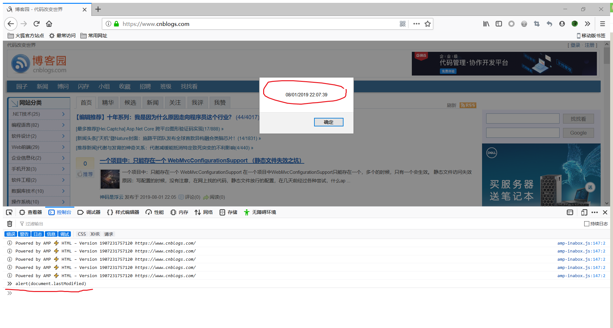
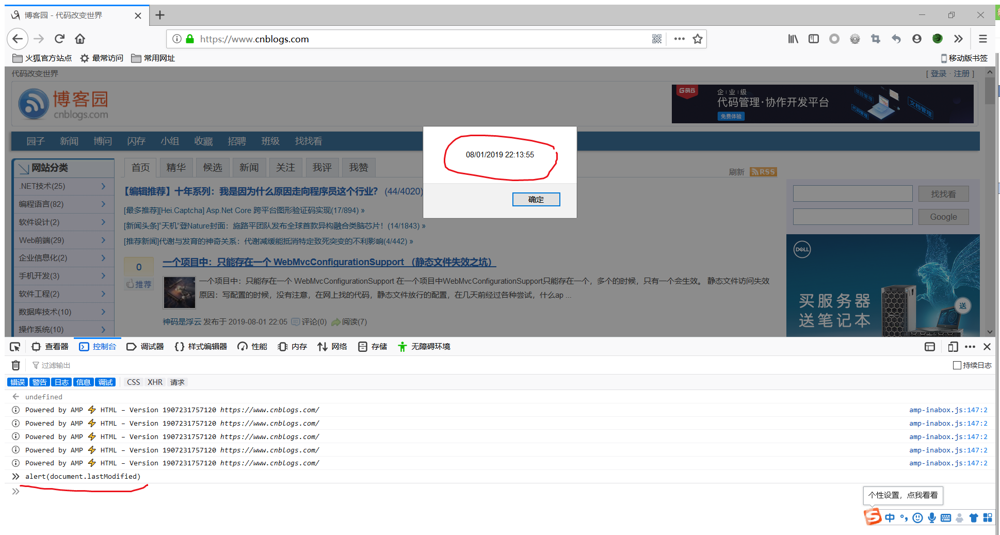

在渗透测试的时候我们得判断脚本语言，非静态网站的后缀名为脚本语言的后缀，如php、asp、jsp、aspx、py；静态网站的后缀，如html、htm、shtml等。
可通过查看网站最后修改时间来判断网站是不是伪静态。
我们拿博客园来做例子。
原理： 查看到的时间为当前时间的话， 那么它很有可能是伪静态的， 如果看到的日期是以前的，那么它很可能就是静态页面了。
第一次：

刷新页面，第二次：

从中我们可以看出博客园是一个伪静态页面。
